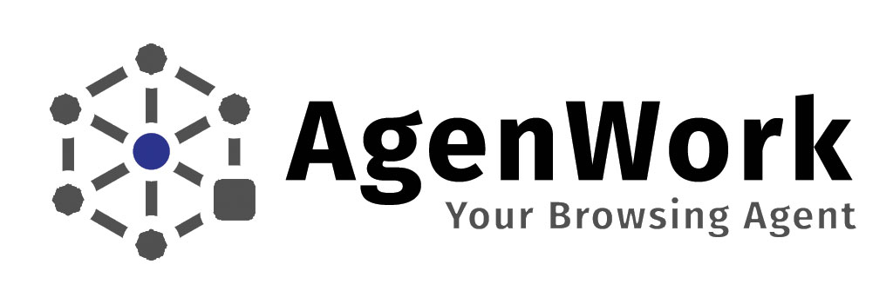

<div align="center">



### Intelligent AI-Powered Chrome Extension

[](https://www.google.com/chrome/)
[](https://developer.chrome.com/docs/extensions/mv3/)
[](https://www.gnu.org/licenses/gpl-3.0)
[](https://developer.mozilla.org/en-US/docs/Web/JavaScript)
[](https://dexie.org/)
[](https://developer.chrome.com/docs/ai/built-in)

**A smart browsing agent that provides instant answers, intelligent suggestions, and automated tasks using Chrome's Built-in AI APIs.**

[Features](#-features) • [Installation](#-installation) • [Usage](#-usage) • [Testing](#-testing) • [Architecture](#-architecture) • [Contributing](#-contributing)

</div>

---

## 📋 Table of Contents

- [Overview](#-overview)
- [Features](#-features)
- [System Requirements](#-system-requirements)
- [Installation](#-installation)
- [Usage](#-usage)
- [AI Agents](#-ai-agents)
- [Testing](#-testing)
- [Architecture](#-architecture)
- [Development](#-development)
- [Contributing](#-contributing)
- [License](#-license)

---

## 🌟 Overview

**AgenWork** is a cutting-edge Chrome extension that leverages Chrome's Built-in AI APIs to provide intelligent, privacy-focused assistance directly in your browser. With a modular multi-agent architecture, AgenWork offers summarization, translation, writing assistance, and conversational AI capabilities—all processed locally on your device.

### Why AgenWork?

- ✅ **Privacy-First**: All AI processing happens on-device using Chrome's Built-in AI
- ✅ **No API Keys Required**: No external API calls or data transmission
- ✅ **Offline Capable**: Works without internet connection once models are downloaded
- ✅ **Intelligent Intent Detection**: Automatically routes requests to the appropriate AI agent
- ✅ **Modular Architecture**: Clean, maintainable, and extensible codebase
- ✅ **Persistent Storage**: Local database using DexieJS for conversation history

---

## 🚀 Features

### Core Capabilities

| Feature | Description | Status |
|---------|-------------|--------|
| 🤖 **Multi-Agent System** | Orchestrates Summarizer, Translator, Writer, and Prompter agents | ✅ Active |
| 💬 **Conversation Interface** | Clean, intuitive chat UI for AI interactions | ✅ Active |
| 📌 **Floating Icon** | Draggable, repositionable quick-access button on any webpage | ✅ Active |
| 💾 **Offline Storage** | Local persistence with DexieJS (IndexedDB wrapper) | ✅ Active |
| 🎯 **Intent Detection** | Smart request routing based on natural language understanding | ✅ Active |
| 🔒 **Privacy-Focused** | Client-side processing, no external API calls | ✅ Active |
| 📊 **Progress Tracking** | Real-time feedback during model downloads and processing | ✅ Active |

### AI Agent Capabilities

#### ✅ Summarizer Agent (Fully Implemented)
- Intelligent content extraction from web pages
- Multiple summary types: **key-points**, **tldr**, **teaser**, **headline**
- Configurable lengths: **short**, **medium**, **long**
- Automatic type and length detection from natural language
- Context-aware summarization with metadata

#### ✅ Translator Agent (Fully Implemented)
- Real-time language detection
- Multi-language translation support
- Batch translation capabilities
- Seamless integration with Chrome Translator API

#### ✅ Prompter Agent (Fully Implemented)
- General-purpose conversational AI
- Intent classification and routing
- Context-aware responses
- Prompt engineering optimization

#### 🚧 Writer Agent (In Development)
- Writing assistance and content generation
- Style adaptation and grammar checking
- Future Chrome Writer API integration

---

## 💻 System Requirements

### Minimum Requirements (Basic Functionality)

- **Browser**: Chrome 88+ or Chromium-based browser
- **OS**: Windows 10+, macOS 10.15+, Linux, or ChromeOS
- **RAM**: 4GB
- **Storage**: 500MB free space

### Recommended Requirements (Full AI Functionality)

- **Browser**: Chrome 138+ (Stable release with Built-in AI APIs)
- **OS**: 
  - Windows 10/11
  - macOS 13+ (Ventura or later)
  - Linux (kernel 4.18+)
  - ChromeOS (Chromebook Plus devices)
- **RAM**: 16GB or more
- **Storage**: 22GB free space (for AI model downloads)
- **GPU**: 4GB+ VRAM (recommended) or powerful CPU

---

## 📦 Installation

### Option 1: Install from Source (Development Mode)

1. **Clone the Repository**
   ```bash
   git clone https://github.com/iyinusa/agenwork.git
   cd agenwork
   ```

2. **Load Extension in Chrome**
   - Open Chrome and navigate to `chrome://extensions/`
   - Enable **"Developer mode"** (toggle in top-right corner)
   - Click **"Load unpacked"**
   - Select the `agenwork` project folder
   - The AgenWork extension icon should appear in your toolbar

3. **Verify Chrome AI API Support**
   - Check Chrome version: `chrome://version/` (should be 138+)
   - Enable AI features: `chrome://flags/#optimization-guide-on-device-model` → **Enabled BypassPerfRequirement**
   - Verify models: `chrome://on-device-internals/` → Check component availability
   - Restart Chrome after enabling flags

### Option 2: Install from Chrome Web Store (Coming Soon)

*AgenWork will be available on the Chrome Web Store soon.*

---

## 🎯 Usage

### Getting Started

1. **Open AgenWork**
   - Click the AgenWork icon in your Chrome toolbar
   - Or use the floating icon on any webpage (if enabled)

2. **Start a Conversation**
   - Type your query in the input field
   - Press **Enter** or click **Send**
   - AgenWork will automatically detect your intent and route to the appropriate AI agent

### Common Use Cases

#### Summarization
```
"Summarize this page"
"Give me the key points of this article"
"tldr this content"
"Provide a brief overview"
"What are the main highlights?"
```

#### Translation
```
"Translate to Spanish: Hello world"
"What language is this: Bonjour"
"Translate this page to French"
```

#### General Queries
```
"Explain quantum computing"
"What is machine learning?"
"Help me understand blockchain"
```

---

## 🧪 Testing

### Automated Tests

Run the included test suite to verify functionality:

1. **Test AI Implementation**
   ```bash
   # Open in Chrome
   chrome tests/test-ai-implementation.html
   ```

2. **Test Database Operations**
   ```bash
   chrome tests/test-database.html
   ```

3. **Test Prompt API**
   ```bash
   chrome tests/test-prompt-api.html
   ```

4. **Test Translator Agent**
   ```bash
   chrome tests/test-translator.html
   ```

### Manual Testing

#### Test Summarizer Agent

1. Navigate to any article (e.g., Wikipedia, Medium, news sites)
2. Open AgenWork popup
3. Try these sample prompts:

**Sample Test Prompts:**
```
✅ "Summarize this page"
✅ "Give me key points of this article"
✅ "tldr"
✅ "Provide a short summary"
✅ "What are the main highlights in medium length?"
✅ "Give me a long detailed summary"
✅ "Create a teaser for this article"
✅ "Generate a headline"
```

**Expected Results:**
- ✅ Intent detection identifies summarization request
- ✅ Appropriate summary type and length are detected
- ✅ Content is intelligently extracted from the page
- ✅ Progress indicators show during processing
- ✅ Well-formatted summary with metadata is displayed

#### Test Translator Agent

**Sample Test Prompts:**
```
✅ "Translate to Spanish: Hello, how are you?"
✅ "Detect language: Bonjour le monde"
✅ "Translate this text to French: [paste text]"
✅ "What language is: こんにちは"
```

#### Test Prompter Agent

**Sample Test Prompts:**
```
✅ "What is artificial intelligence?"
✅ "Explain neural networks"
✅ "Help me understand quantum computing"
✅ "What are the benefits of using AI?"
```

### Debugging

Enable verbose logging:
```javascript
// In browser console (DevTools)
localStorage.setItem('agenwork_debug', 'true');
```

Check AI model status:
```
chrome://on-device-internals/
```

---

## 🏗️ Architecture

### System Architecture

```
┌─────────────────────────────────────────────────────────────┐
│                     AgenWork Extension                      │
├─────────────────────────────────────────────────────────────┤
│                                                             │
│  ┌────────────┐    ┌──────────────┐    ┌──────────────┐   │
│  │  Popup UI  │───▶│   Core AI    │───▶│   Storage    │   │
│  │ (popup.js) │    │   Agents     │    │  (DexieJS)   │   │
│  └────────────┘    │  (core.js)   │    └──────────────┘   │
│                    └──────┬───────┘                        │
│                           │                                │
│         ┌─────────────────┼─────────────────┐              │
│         │                 │                 │              │
│   ┌─────▼──────┐   ┌─────▼──────┐   ┌─────▼──────┐       │
│   │Summarizer  │   │Translator  │   │ Prompter   │       │
│   │   Agent    │   │   Agent    │   │   Agent    │       │
│   └─────┬──────┘   └─────┬──────┘   └─────┬──────┘       │
│         │                │                 │              │
│         └────────────────┼─────────────────┘              │
│                          │                                │
│                 ┌────────▼─────────┐                       │
│                 │ Chrome AI APIs   │                       │
│                 │ Integration      │                       │
│                 └──────────────────┘                       │
│                          │                                │
└──────────────────────────┼─────────────────────────────────┘
                           │
              ┌────────────▼────────────┐
              │  Chrome Built-in AI     │
              │  - Summarizer API       │
              │  - Translator API       │
              │  - Language Model API   │
              │  - Writer API (Future)  │
              └─────────────────────────┘
```

### Module Structure

```
agenwork/
├── manifest.json                 # Extension configuration (Manifest V3)
├── popup.html                   # Main UI interface
├── LICENSE                      # GPL v3 License
├── README.md                    # Documentation
│
├── css/                         # Stylesheets
│   ├── popup.css               # Main popup styles
│   ├── content.css             # Content script styles
│   ├── markdown.css            # Markdown rendering styles
│   └── fontawesome.css         # Icon fonts
│
├── js/                          # JavaScript modules
│   ├── popup.js                # Main popup controller
│   ├── content.js              # Content script coordinator
│   ├── background.js           # Service worker
│   ├── database.js             # DexieJS database wrapper
│   ├── dexie.min.js            # DexieJS library (IndexedDB)
│   ├── floating-icon.js        # Floating UI component
│   ├── markdown-renderer.js    # Markdown processing
│   └── ai-agents.js            # Legacy compatibility layer
│
├── js/ai-agents/                # Modular AI agent system
│   ├── index.js                # System initialization
│   ├── core.js                 # Main orchestration (1861 lines)
│   ├── utils.js                # Shared utilities
│   ├── chrome-integration.js   # Chrome API integration
│   ├── summarizer.js           # Summarization agent
│   ├── translator.js           # Translation agent
│   ├── prompter.js             # Language model agent
│   └── writer.js               # Writing assistant agent
│
├── tests/                       # Test suite
│   ├── test-ai-implementation.html
│   ├── test-database.html
│   ├── test-prompt-api.html
│   └── test-translator.html
│
└── docs/                        # Documentation
    ├── MODULAR_ARCHITECTURE.md
    ├── ENHANCED_SUMMARIZATION.md
    └── translator-agent-guide.md
```

### Technology Stack

| Component | Technology | Purpose |
|-----------|-----------|---------|
| **Extension Framework** | Chrome Manifest V3 | Modern extension architecture |
| **Database** | DexieJS 3.x | IndexedDB wrapper for local storage |
| **AI Processing** | Chrome Built-in AI APIs | On-device AI (Summarizer, Translator, Language Model) |
| **UI Framework** | Vanilla JavaScript | Lightweight, no dependencies |
| **Styling** | CSS3 + FontAwesome | Responsive design with icons |
| **Markdown** | Custom Renderer | Format AI responses |
| **Architecture** | Modular ES6+ | Separation of concerns, scalability |

### Key Design Patterns

- **Multi-Agent System**: Specialized agents for different AI tasks
- **Intent Detection**: Automatic routing based on natural language understanding
- **Pub/Sub Messaging**: Communication between extension components
- **Progressive Enhancement**: Graceful degradation when AI APIs unavailable
- **Offline-First**: Local storage and processing capabilities

---

## 🛠️ Development

### Project Structure Details

#### Core Modules

1. **`utils.js`** - Shared utilities
   - Text preprocessing and sanitization
   - Language detection logic
   - Progress notification system
   - Input validation helpers

2. **`chrome-integration.js`** - Chrome API layer
   - Chrome AI API availability checks
   - Page content extraction
   - Environment validation
   - Version detection

3. **`summarizer.js`** - Summarization agent
   - Chrome Summarizer API integration
   - Multiple summary formats (key-points, tldr, teaser, headline)
   - Configurable lengths (short, medium, long)
   - Progress tracking and error handling

4. **`translator.js`** - Translation agent
   - Chrome Translator API integration
   - Language detection and translation
   - Batch translation support
   - Translation quality validation

5. **`prompter.js`** - Language model agent
   - Chrome Language Model API integration
   - Intent detection and classification
   - Prompt engineering and optimization
   - Context-aware responses

6. **`writer.js`** - Writing assistant agent (Future)
   - Chrome Writer API integration (when available)
   - Content generation assistance
   - Writing style adaptation

7. **`core.js`** - Main orchestration class
   - Agent lifecycle management
   - Request routing and coordination
   - Unified API interface
   - Error handling and recovery

#### Module Loading Order

The system loads modules in dependency order:

```javascript
1. utils.js                  // Base utilities
2. chrome-integration.js     // Chrome API layer
3. summarizer.js            // Summarization agent
4. translator.js            // Translation agent
5. prompter.js              // Prompter agent
6. writer.js                // Writer agent
7. core.js                  // Main coordination class
8. index.js                 // System initialization
```

### Building from Source

No build process required! This is a pure JavaScript extension.

1. Clone the repository
2. Make your changes
3. Reload the extension in `chrome://extensions/`

### Code Style

- **JavaScript**: ES6+ features, modular architecture
- **Indentation**: 2 spaces
- **Comments**: JSDoc-style for functions and classes
- **Naming**: camelCase for variables/functions, PascalCase for classes

---

## 🤝 Contributing

Contributions are welcome! Please follow these guidelines:

### How to Contribute

1. **Fork the repository**
2. **Create a feature branch**
   ```bash
   git checkout -b feature/your-feature-name
   ```
3. **Make your changes**
   - Follow the existing code style
   - Add tests for new features
   - Update documentation as needed
4. **Commit your changes**
   ```bash
   git commit -m "feat: add your feature description"
   ```
5. **Push to your fork**
   ```bash
   git push origin feature/your-feature-name
   ```
6. **Open a Pull Request**

### Development Guidelines

- ✅ Write clean, documented code
- ✅ Follow the modular architecture pattern
- ✅ Add tests for new features
- ✅ Update README and docs for user-facing changes
- ✅ Ensure backward compatibility
- ✅ Test on multiple Chrome versions (if possible)

### Reporting Issues

Found a bug? Have a feature request?

1. Check existing issues first
2. Create a new issue with:
   - Clear title and description
   - Steps to reproduce (for bugs)
   - Expected vs actual behavior
   - Chrome version and OS
   - Screenshots (if applicable)

---

## 📄 License

This project is licensed under the **GNU General Public License v3.0**.

```
AgenWork - Intelligent AI-Powered Chrome Extension
Copyright (C) 2024 AgenWork Contributors

This program is free software: you can redistribute it and/or modify
it under the terms of the GNU General Public License as published by
the Free Software Foundation, either version 3 of the License, or
(at your option) any later version.

This program is distributed in the hope that it will be useful,
but WITHOUT ANY WARRANTY; without even the implied warranty of
MERCHANTABILITY or FITNESS FOR A PARTICULAR PURPOSE. See the
GNU General Public License for more details.

You should have received a copy of the GNU General Public License
along with this program. If not, see <https://www.gnu.org/licenses/>.
```

See [LICENSE](LICENSE) for the full license text.

---

## 🙏 Acknowledgments

- **Chrome AI Team** for developing the Built-in AI APIs
- **DexieJS** for the excellent IndexedDB wrapper
- **FontAwesome** for the icon library
- All contributors who have helped improve AgenWork

---

## 📞 Support

- **Documentation**: [docs/](docs/)
- **Issues**: [GitHub Issues](https://github.com/iyinusa/agenwork/issues)
- **Discussions**: [GitHub Discussions](https://github.com/iyinusa/agenwork/discussions)

---

## 🗺️ Roadmap

### Current Version (v1.1.0)
- ✅ Multi-agent system architecture
- ✅ Summarizer agent with enhanced capabilities
- ✅ Translator agent with language detection
- ✅ Prompter agent for general queries
- ✅ Local database with DexieJS
- ✅ Floating icon UI component

### Upcoming Features (v1.2.0)
- 🚧 Writer agent integration
- 🚧 Context menu integration
- 🚧 Keyboard shortcuts
- 🚧 Export conversations
- 🚧 Custom agent configurations

### Future Vision (v2.0.0)
- 📋 Multi-tab coordination
- 📋 Agent plugin system
- 📋 Advanced analytics
- 📋 Team collaboration features
- 📋 API for third-party integrations

---

<div align="center">

**Made with ❤️ by the AgenWork Team**

[⬆ Back to Top](#intelligent-ai-powered-chrome-extension)
